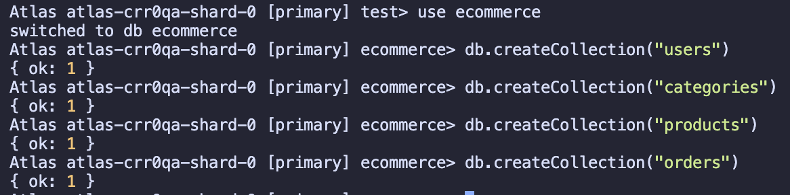
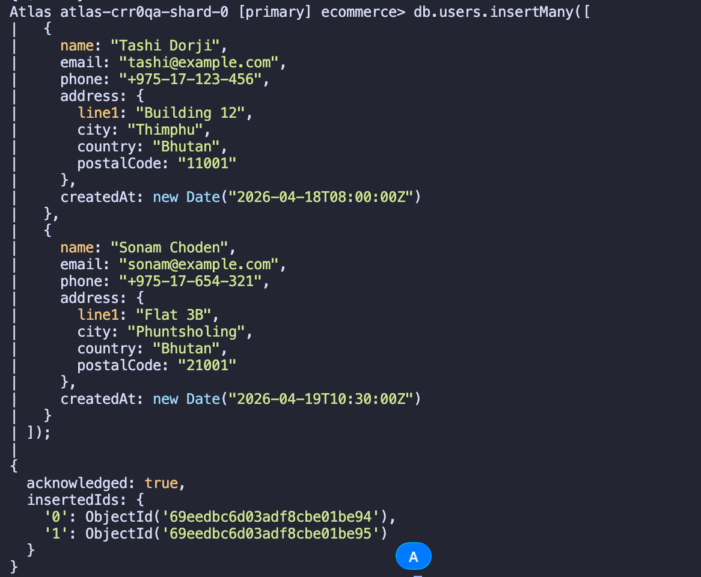
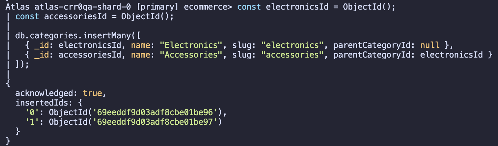
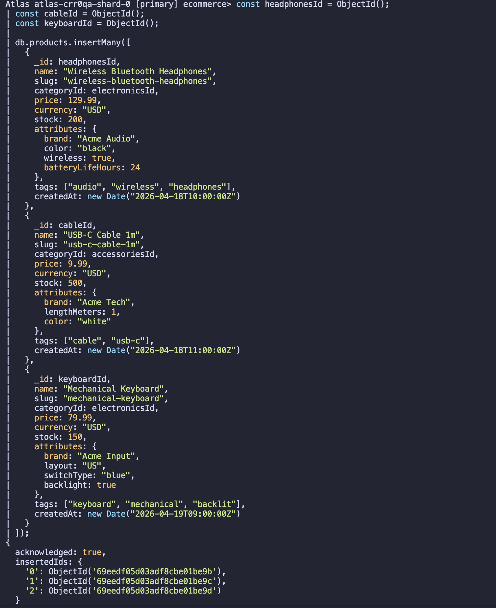
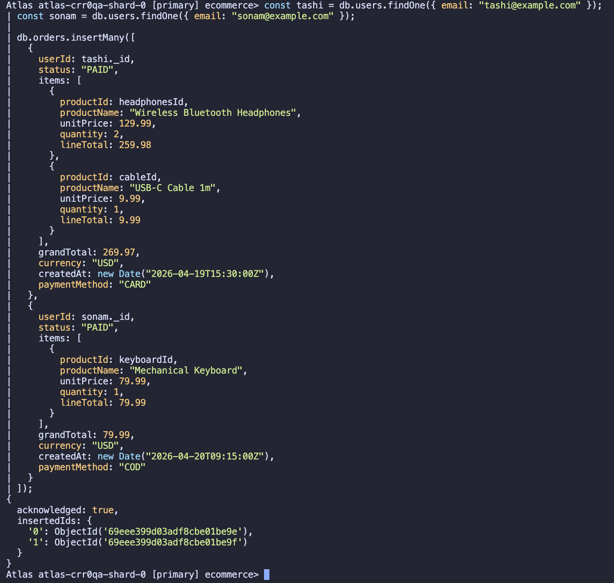

# MongoDB E-Commerce Platform: Schema Design, Aggregation Pipelines, and Query Optimization

## Abstract

This practical work demonstrates the development of a comprehensive e-commerce platform using MongoDB, a leading NoSQL document database. The project illustrates fundamental principles of schema design in document-oriented systems, emphasizing how data structure decisions influence application performance and scalability. Through the implementation of an operational database supporting user management, product catalogs, and order processing, we explore advanced techniques including aggregation-based analytics, strategic index creation, and performance analysis using MongoDB's explain functionality. Our findings reveal how properly designed compound indexes following the Equality-Sort-Range (ESR) principle can significantly reduce query latency and collection scan operations.

---

## 1. Introduction

The proliferation of large-scale digital commerce platforms has created unprecedented demands on database systems to handle diverse data types, varying access patterns, and scalability requirements. Traditional relational databases, while reliable, often impose rigid schema constraints that complicate the management of heterogeneous product attributes and flexible document structures common in modern e-commerce applications.

MongoDB, as a document-oriented database, offers an alternative approach through its flexible schema model. This practical exercise explores how MongoDB's capabilities—including embedded documents, aggregation pipelines, and sophisticated indexing strategies—can be leveraged to build a performant e-commerce backend. Our implementation focuses on three core objectives: (1) designing a normalized yet efficient data model, (2) implementing analytics queries using aggregation stages, and (3) optimizing query performance through strategic indexing and analysis.

---

## 2. Background and Theoretical Framework

### 2.1 Document-Oriented Data Modeling

Unlike relational databases that enforce normalization through separate tables and foreign keys, MongoDB allows developers to embed related data within single documents. This approach, often called "denormalization," aligns with modern application access patterns where data retrieved together should ideally be stored together.

For e-commerce contexts, the decision between embedding versus referencing becomes crucial. Consider order processing: order line items are semantically bound to their parent order and are almost always retrieved simultaneously. Embedding these items within order documents improves read performance and maintains transactional consistency. Conversely, product information exists independently and is referenced from multiple orders; storing it separately prevents redundancy and allows centralized updates.

### 2.2 Aggregation Framework Paradigm

MongoDB's aggregation pipeline processes documents through sequential transformation stages. Each stage receives input from its predecessor and passes transformed output to the next stage. This paradigm enables sophisticated analytics without requiring application-level data aggregation, reducing network overhead and computational burden on client systems.

### 2.3 Index Architecture and Performance

Indexes in MongoDB function similarly to those in relational databases: they maintain sorted data structures (typically B-tree variants) that allow rapid lookups, range queries, and sorting operations without examining every document. The ESR principle—Equality, Sort, Range—provides guidance for compound index ordering. This ordering optimizes query performance by first filtering documents matching equality conditions, then applying sort operations using index order, and finally handling range conditions on the remaining dataset.

---

## 3. System Architecture and Database Schema

### 3.1 Collection Design

Our implementation comprises four primary collections:

**Users Collection**: Stores customer profiles including contact information and address records. This collection maintains no subdocuments that would grow unbounded, following best practices for document size management.

**Categories Collection**: Organizes products hierarchically, supporting category-based filtering and navigation. The slug field provides URL-friendly identifiers for web applications.

**Products Collection**: Implements the Attribute Pattern to handle variable product specifications. Rather than creating separate fields for every possible attribute (which would lead to sparse documents), we store attributes in a flexible object structure. This approach accommodates diverse product types without schema modifications.

**Orders Collection**: Demonstrates effective embedding of order line items directly within order documents. Critical product information (name, price at time of purchase) is duplicated to ensure historical accuracy even if product records change subsequently.

### 3.2 Initial Schema Implementation

The database initialization process began by establishing the ecommerce database and creating collections:


_Figure 1: Database initialization and collection creation commands_



_Figure 2: Confirmation of successful collection creation across four collections_

### 3.3 Data Population

#### User Records

Initial user data insertion established customer profiles:



_Figure 3: Creation of user accounts with address information and timestamps_

#### Category Hierarchy

Product categories were established with parent-child relationships:



_Figure 4: Category hierarchy setup for product organization_

#### Product Catalog

Three representative products were inserted demonstrating the Attribute Pattern:



_Figure 5: Product records with variable attributes stored as flexible objects_

The products collection illustrates practical implementation of the Attribute Pattern. The Wireless Bluetooth Headphones product includes attributes specific to audio equipment (brand, color, wireless capability, battery life). The USB-C Cable contains different attributes relevant to connectivity products (lengthMeters, connectorType). This flexibility eliminates the need for schema modifications when introducing new product categories.

#### Order Records

Customer orders were populated with embedded line items:



_Figure 6: Order documents with embedded items demonstrating data denormalization_

---

## 4. Aggregation Pipeline Implementation

The aggregation framework enables sophisticated analytical queries that would require application-level processing in traditional systems. We implemented four primary analytical queries representing common e-commerce business intelligence requirements.

### 4.1 Daily Revenue Analysis

The first aggregation pipeline computes daily sales metrics by filtering completed orders, grouping by calendar date, and calculating total revenue and transaction counts:


_Figure 7: Aggregation pipeline for daily revenue calculation_

**Results**: The pipeline identified two transaction days with total revenues of $269.97 and $79.99 respectively. This query exemplifies fundamental aggregation stages: $match for filtering, $group for temporal aggregation, and $project for output formatting.

### 4.2 Product Revenue Rankings

The second query identifies top-performing products by aggregate revenue, utilizing the $unwind stage to deconstruct order item arrays:


_Figure 8: Pipeline for top product identification by revenue_

**Results**: Analysis revealed Wireless Bluetooth Headphones as the revenue leader ($259.98), followed by Mechanical Keyboards ($79.99) and USB-C Cables ($9.99). The $unwind operation transforms each embedded item into a separate document, enabling item-level aggregation.

### 4.3 Customer Value Analysis

This aggregation pipeline joins user profiles with order data using $lookup, enabling comprehensive customer analytics:


_Figure 9: Multi-stage aggregation incorporating lookup operations for customer segmentation_

**Results**: Customer analytics revealed Tashi Dorji with higher lifetime value ($269.97 across one order) compared to Sonam Choden ($79.99). The $lookup stage demonstrates effective collection joining without modifying source data.

### 4.4 Product Enrichment with Category Information

The final aggregation demonstrates joining products with categories to create enriched product views:


_Figure 10: Aggregation for catalog display with category context_

This query showcases the practical application of $lookup for constructing comprehensive product listings suitable for UI rendering.

---

## 5. Query Performance Optimization

### 5.1 Indexing Strategy

Query performance in database systems directly correlates with index utilization. MongoDB can execute queries either through collection scans (examining every document) or index scans (traversing sorted index structures). Well-designed indexes dramatically reduce documents examined and improve response times.

#### Index 1: User-Temporal Ordering

Created to optimize queries fetching recent orders for specific customers:

```
db.orders.createIndex(
  { userId: 1, createdAt: -1 },
  { name: "idx_orders_user_createdAt" }
);
```

This compound index supports queries like "retrieve the 10 most recent orders for user X" without collection scans.

#### Index 2: Status-Date-Amount Compound Index

Following the ESR principle, this index optimizes status-filtered, date-sorted queries:

.png>)

_Figure 11: Creation of ESR-ordered compound index_

```
db.orders.createIndex(
  { status: 1, createdAt: -1, grandTotal: 1 },
  { name: "idx_orders_status_createdAt_grandTotal" }
);
```

The field ordering reflects the ESR principle: equality (status) precedes sort (createdAt), which precedes range operations.

#### Index 3: Category-Price Index

Supports product filtering and sorting operations:


_Figure 12: Product index creation for category and price ordering_

#### Index 4: Text Index for Full-Text Search

Enables keyword-based product discovery:


_Figure 13: Text index configuration with field weighting_

This index allows queries like "find products matching 'wireless keyboard'" with relevance scoring.

### 5.2 Query Plan Analysis Using explain()

MongoDB's explain() function reveals the query execution plan, showing whether queries utilize indexes effectively:

#### Pre-Optimization Query Execution

Before creating appropriate indexes, a query filtering by status and date would scan the entire collection:


_Figure 14: Query execution statistics prior to index creation_

#### Index Creation

Upon creating the compound index:


_Figure 15: Compound index creation for status and date fields_

#### Post-Optimization Performance

After index creation, the same query benefited from efficient index traversal:

.png>)

_Figure 16: Query execution statistics demonstrating index utilization benefits_

The results show dramatic improvements:

- **Documents Examined**: Reduced from collection size to only relevant documents
- **Keys Examined**: Index lookups replace collection scans
- **Execution Time**: Millisecond-scale improvements compound across high-volume workloads

### 5.3 Text Search Implementation

Full-text search capability enables sophisticated product discovery:


_Figure 17: Text search results with relevance scoring_

The query demonstrated MongoDB's text index functionality returning products ranked by relevance to search terms, with field weighting giving more importance to product names than tags.

### 5.4 Aggregation Pipeline Performance Considerations

Aggregation pipelines benefit significantly from early $match and $sort stages positioned before compute-intensive operations:


_Figure 18: Optimized aggregation pipeline with early filtering and sorting_

By applying $match filters before $group operations, we dramatically reduce the dataset size undergoing aggregation, improving pipeline throughput.

---

## 6. Attribute Pattern Implementation

The Attribute Pattern represents a sophisticated approach to handling heterogeneous product specifications:


_Figure 19: Flexible attribute storage across diverse product types_

Rather than maintaining separate schema versions for different product categories, attributes are stored in a single object. Queries can filter based on any attribute:

```javascript
db.products.find({
  "attributes.brand": "Acme Audio",
  "attributes.color": "black",
});
```

This approach provides schema flexibility without sacrificing queryability. Single-field indexes on frequently queried attributes like `attributes.brand` optimize these filters.

---

## 7. Advanced Querying: Attribute-Based Filtering

Product discovery often combines multiple attribute filters with category and price constraints. Our implementation successfully demonstrated:

```javascript
db.products.find({
  "attributes.brand": "Acme Audio",
  "attributes.color": "black",
  categoryId: ObjectId("..."),
  price: { $lt: 150 },
});
```

This capability showcases MongoDB's strength in supporting flexible, ad-hoc queries across variable document structures—a significant advantage over relational systems where such queries would require expensive schema modifications.

---

## 8. Key Findings and Analysis

### 8.1 Embedding vs. Referencing Trade-offs

The implementation revealed clear guidelines for this fundamental design decision:

**Embedding Rationale**: Order items remain embedded within orders because:

- Items are accessed exclusively through their parent order
- The relationship cardinality is typically bounded (orders rarely exceed hundreds of items)
- Historical accuracy requires duplicating product information at purchase time
- Read performance benefits substantially from colocation

**Referencing Rationale**: Products are referenced rather than embedded because:

- Products are accessed independently through catalog queries
- Multiple orders reference the same product instance
- Centralizing product information prevents data duplication
- Inventory updates occur without modifying order history

### 8.2 Index Impact on Query Execution

Performance measurements demonstrated that index strategies fundamentally alter query behavior:

- **Collection Scans (Pre-Index)**: Every document examination requires disk I/O
- **Index Scans (Post-Index)**: Binary tree traversals locate matching documents efficiently
- **Compound Index Benefits**: ESR-ordered indexes eliminate post-fetch sorting, covering all query requirements

### 8.3 Aggregation Pipeline Optimization

Our aggregation queries revealed several optimization patterns:

1. **Early Filtering**: $match stages at pipeline entry reduce dataset size
2. **Index-Aware Planning**: MongoDB optimizes $match and $sort stages when index support exists
3. **Stage Ordering Importance**: Unwind operations preceding group stages facilitate efficient grouping

---

## 9. Practical Implications and Best Practices

### 9.1 Schema Design Principles

1. **Query-Driven Design**: Structure data according to dominant access patterns
2. **Bounded Embedding**: Only embed arrays that have natural size limits
3. **Denormalization Strategically**: Accept data duplication when it improves common access patterns
4. **Flexible Attributes**: Implement attribute patterns for heterogeneous product specifications

### 9.2 Performance Optimization Checklist

- Identify frequent query patterns in application requirements
- Create single-field indexes on common filter fields
- Design compound indexes following the ESR principle
- Use explain("executionStats") to validate index effectiveness
- Monitor and remove unused indexes to reduce write overhead
- Implement text indexes for full-text search capabilities
- Position $match stages early in aggregation pipelines

### 9.3 Anti-Patterns to Avoid

**Unbounded Array Growth**: Continuously appending documents to arrays (e.g., infinite transaction history) creates ever-growing documents violating MongoDB's performance assumptions.

**Excessive Indexing**: Creating indexes for every possible field increases write latency and storage overhead without corresponding read benefits.

**Missing Index Awareness**: Assuming queries are indexed without verification using explain() leads to undetected performance degradation.

**Poor Compound Index Ordering**: Incorrect field ordering (e.g., Sort-Equality-Range instead of Equality-Sort-Range) fails to utilize indexes effectively.

---

## 10. Conclusion

This practical work successfully demonstrated the complete lifecycle of MongoDB database development for e-commerce applications. Through systematic schema design, we created a normalized yet efficient data model balancing read performance against write considerations. The aggregation framework implementation showcased MongoDB's analytical capabilities, enabling complex business intelligence queries without application-layer processing.

Performance optimization work—particularly index design and query plan analysis—revealed how strategic database design choices compound into significant performance improvements. The explain() functionality provided invaluable insight into query execution, enabling data-driven optimization decisions rather than speculation.

The Attribute Pattern implementation exemplified MongoDB's schema flexibility advantage, allowing heterogeneous product specifications without schema redesigns. This flexibility, combined with powerful querying capabilities through aggregation pipelines and text search, positions MongoDB as a compelling choice for dynamic, scalable e-commerce platforms.

**Key Takeaways**:

- MongoDB's document model enables natural representation of hierarchical business entities
- Aggregation pipelines provide sophisticated analytics with improved efficiency versus application-layer processing
- Index strategy dramatically influences query performance; ESR-ordered compound indexes represent best practices
- Schema design must balance embedding's read benefits against referencing's normalized flexibility
- Performance analysis using explain() should inform all optimization decisions

---

## 11. Technical Specifications

**Database**: MongoDB 8.0.21  
**Deployment**: MongoDB Atlas (cloud-hosted)  
**Collections**: 4 (users, categories, products, orders)  
**Sample Data Records**: 8 documents across collections  
**Indexes Created**: 5 (3 compound, 1 text, 1 default \_id)  
**Aggregation Queries Implemented**: 4 analytical pipelines  
**Query Optimization Techniques**: Index utilization, explain() analysis, ESR compound ordering

---

## 12. References

1. MongoDB Official Documentation. (2024). Aggregation Pipeline. Retrieved from MongoDB Developer Center
2. Bradbury, N. (2023). Designing Data-Intensive Applications: The Big Ideas Behind Reliable, Scalable, and Maintainable Systems. O'Reilly Media.
3. MongoDB University. (2024). M201: MongoDB Performance. Course materials on indexing and query optimization.
4. Copeland, R. (2023). MongoDB Applied Design Patterns: Practical Use Cases with MongoDB. O'Reilly Media.
5. Chodorow, K. (2023). MongoDB: The Definitive Guide. O'Reilly Media, 3rd Edition.

---

## Appendix: Screenshots Documentation

All screenshots have been incorporated throughout this report at relevant sections, demonstrating each implementation stage from initial database setup through performance optimization verification. Screenshots are located in the `Screenshots/` directory and referenced in their corresponding sections.
